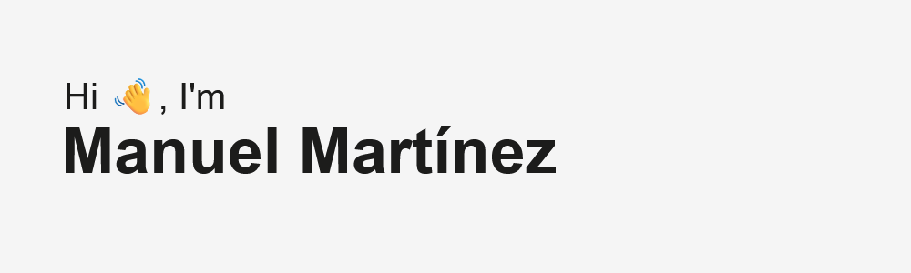

<h1 align="center">I'm Frontend Developer at EncodeLabs!</h1>

 

<h2>👨🏻•💻 About me!</h2>

- 🤔 &nbsp; Exploring new technologies and developing software solutions.

- 🌱 &nbsp; Learning about UX/UI Design.

- 🌎 &nbsp; I'm from Argentina, Córdoba.

<h3>🛠 Tech Stack</h3>

- 💻 &nbsp; Javascript / Typescript / React / Angular / Nextjs / NodeJS / Express / NestJS / PHP - Laravel - Symfony
- 📎&nbsp; Figma / JIRA / Docker 

<!--
<h2>Github Stats!</h2>

--> 
<!--
<h2>Connect with me!</h2>

--> 
 

 
  Visitor count 
  

 
<!--

 
[[https://spotify-github-profile.kittinanx.com/api/view.svg?uid=manumartinez6&redirect=true][https://spotify-github-profile.kittinanx.com/api/view.svg?uid=manumartinez6&cover_image=true&theme=novatorem&show_offline=false&background_color=121212&interchange=false&bar_color=53b14f&bar_color_cover=true)]]
 -->
<h2> 🐍 A Snake Eating my Contributions Graph</h2>
	

	

